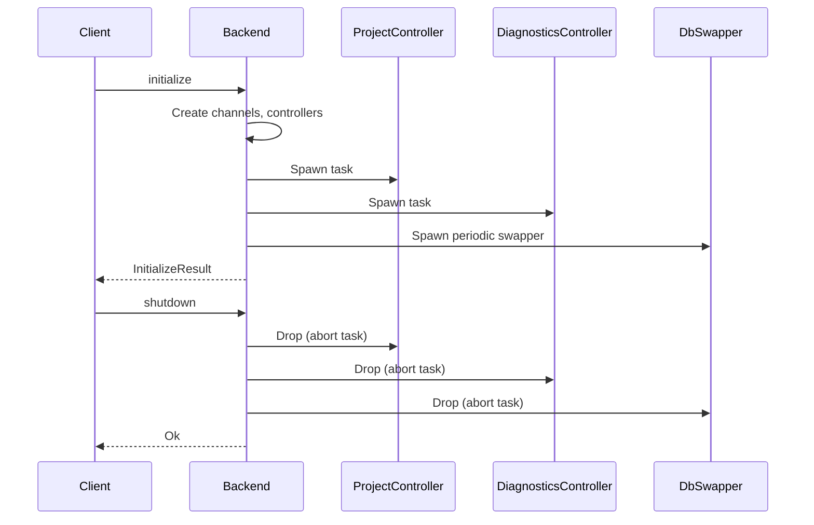
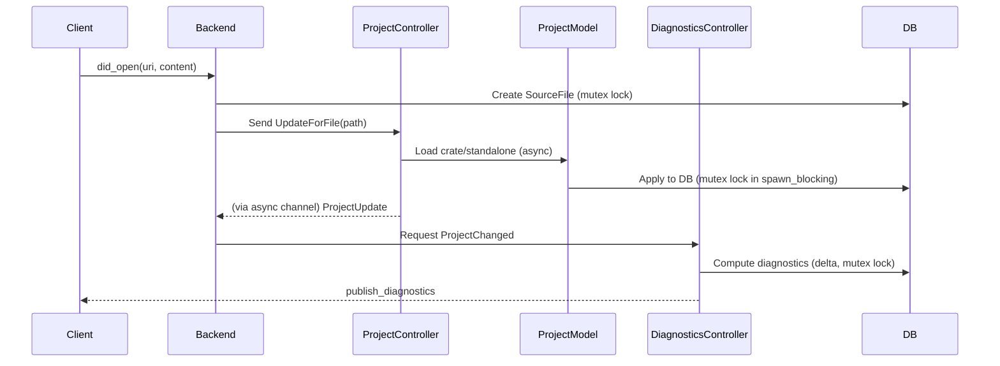
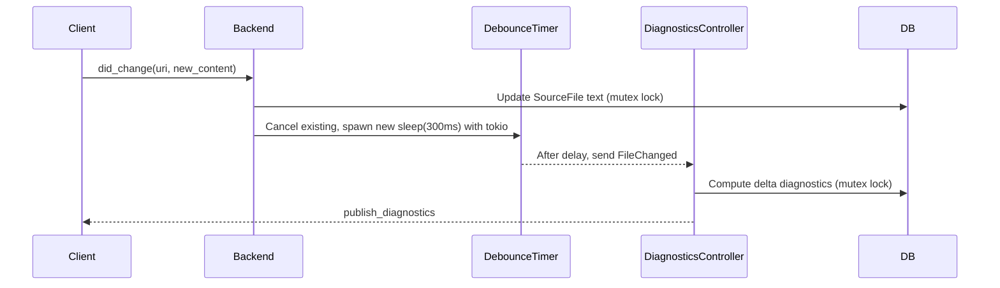
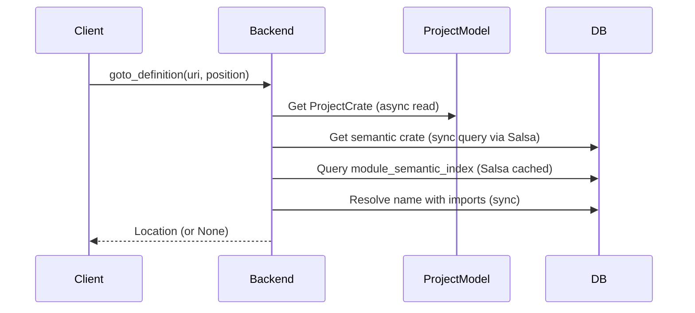

# Cairo-M Language Server (cairo-m-ls) Design Document

## Overview

The `cairo-m-ls` crate implements a Language Server Protocol (LSP) server for
the Cairo-M programming language. It provides features like syntax highlighting,
diagnostics, go-to-definition, hover information, and code completion. The
server is built on top of the `tower-lsp` crate for LSP handling and integrates
deeply with the Cairo-M compiler phases (parsing, semantic analysis, MIR
generation, and code generation) via Salsa for incremental computation.

This document serves as internal documentation, detailing the crate's structure,
organization, and key design decisions. It focuses on how the language server
leverages asynchronous programming with Tokio to maintain responsiveness, the
flow of client requests, and the modular architecture.

### Key Goals

- **Responsiveness**: Handle LSP requests without blocking the main thread,
  using background tasks for expensive operations like parsing, semantic
  analysis, and diagnostics computation.
- **Incremental Compilation**: Integrate with Salsa to recompute only changed
  parts of the analysis.
- **Project Awareness**: Support multi-file projects with automatic discovery
  and cross-file references.
- **Memory Management**: Periodic database swapping to prevent unbounded memory
  growth in long-running sessions.
- **Extensibility**: Modular design with controllers for diagnostics and project
  management.

### Dependencies

- `tower-lsp`: LSP protocol implementation.
- `tokio`: Async runtime for background tasks and channels.
- `salsa`: Incremental computation framework integrated into the compiler DB.
- `tracing`: Logging with LSP forwarding.
- `notify`: File system watching for manifest changes.
- `dashmap`: For concurrent maps like debounce timers.
- Cairo-M compiler crates: For parsing, semantics, MIR, and codegen.

## Asynchronous Programming with Tokio

The language server operates in an asynchronous environment to handle concurrent
client requests efficiently. Tokio, Rust's async runtime, is used extensively to
manage this concurrency without blocking threads.

### Why Async?

- LSP servers must respond quickly to client requests (e.g., hover, completion)
  to provide a smooth IDE experience.
- Operations like parsing files, semantic analysis, or diagnostics can be
  computationally expensive, especially for large projects.
- Blocking the main thread would delay responses, leading to a sluggish user
  experience.

### How We Leverage Tokio

- **Background Tasks**: Heavy computations (e.g., diagnostics, project loading)
  are offloaded to `tokio::spawn` tasks. These run concurrently on Tokio's
  thread pool.
- **Channels (mpsc)**: Unbounded channels
  (`tokio::sync::mpsc::unbounded_channel`) facilitate communication between the
  main LSP handler and background workers. For example:
  - Project updates are sent via channels to a dedicated monitor task.
  - Diagnostics responses are published back to the client via channels.
- **Debouncing**: For frequent events like `did_change`, Tokio timers
  (`tokio::time::sleep`) debounce requests to avoid recomputing diagnostics on
  every keystroke. Per-file timers are managed with DashMap.
- **File Watching**: `notify` integrated with Tokio watches for changes in
  project manifests (e.g., `cairom.toml`), triggering reloads asynchronously.
- **Mutexes for Shared State**: Shared resources like the analysis database use
  `Arc<Mutex<>>` for safe concurrent access. Locks are acquired in blocking
  tasks (`tokio::task::spawn_blocking`) to avoid async runtime stalls.
- **Graceful Shutdown**: Drop implementations abort tasks and send shutdown
  signals via channels.

This design ensures the LSP remains responsive: client requests are acknowledged
immediately, while work happens in the background.

## Architecture Overview

The crate is organized into modules for separation of concerns:

- **db**: Defines the unified `AnalysisDatabase` (extending compiler phases via
  Salsa) and `ProjectCrate` for project representation. Includes
  `AnalysisDatabaseSwapper` for periodic memory cleanup.
- **diagnostics**: Manages diagnostic computation in a background controller and
  state storage.
- **project**: Handles project discovery, loading, and updates via a controller
  and model.
- **lsp_tracing**: Forwards tracing logs to the LSP client.
- **main**: Implements the `Backend` struct as the LSP server, handling requests
  and coordinating components.
- **utils**: Helper functions (e.g., URI/path conversions).

### Core Components

- **Backend**: The LSP entry point. Implements `LanguageServer` traits. Manages
  shared state (DB, source files) and spawns controllers.
- **Controllers**:
  - `DiagnosticsController`: Background task for computing diagnostics using
    delta tracking (efficient recomputation via Salsa).
  - `ProjectController`: Background task for project updates, manifest watching,
    and caching.
- **Models**:
  - `ProjectModel`: Central store for loaded crates and file-to-project
    mappings.
  - `ProjectDiagnostics`: Thread-safe diagnostic storage.
- **Swapper**: Periodic task to swap the DB and prevent memory leaks from
  Salsa's query accumulation.

### Data Flow

- Client requests (e.g., `did_open`) trigger project discovery and loading.
- Changes (`did_change`) update source files in Salsa inputs, invalidating
  dependent queries.
- Diagnostics are computed asynchronously using delta tracking and published
  back.
- Semantic features (hover, goto) query the DB synchronously but leverage cached
  results.

## Request Flow Diagrams

Below are Mermaid diagrams illustrating the flow for key LSP requests. These
show how client interactions trigger background processes.

### Diagram 1: Initialization and Shutdown

### Diagram 2: File Open (did_open)

### Diagram 3: File Change (did_change) with Debouncing

### Diagram 4: Semantic Requests (e.g., Goto Definition)

## Module Structure and Organization

### 1. **db (Database Management)**

- **Purpose**: Defines the core analysis database integrating all compiler
  phases.
- **Key Types**:
  - `ProjectCrate`: Unified project representation (root dir, main module,
    files).
  - `AnalysisDatabase`: Extends compiler DB with LSP-specific traits.
  - `AnalysisDatabaseSwapper`: Background task for periodic DB refresh (every
    5min) to manage Salsa memory.
- **Traits**: Implements `Upcast` for parser/semantic phases.
- **Extensions**: `ProjectCrateExt` for converting to semantic crates.
- **Design Notes**: Uses Salsa inputs for incremental updates. Swapper snapshots
  state to avoid blocking, with atomic swaps for consistency.

### 2. **diagnostics (Diagnostics Computation)**

- **Purpose**: Handles background diagnostic generation and storage.
- **Key Types**:
  - `DiagnosticsRequest`: Enum for file/project changes or shutdown.
  - `DiagnosticsResponse`: URI, version, and LSP diagnostics.
  - `DiagnosticsController`: Spawns worker task, uses channels for
    requests/responses.
  - `ProjectDiagnostics`: RwLock-wrapped map for thread-safe storage.
- **Key Functions**:
  - `compute_file_diagnostics_delta`: Delta-based computation via
    `DeltaDiagnosticsTracker`.
  - `convert_cairo_diagnostic`: Maps Cairo diagnostics to LSP format.
- **Design Notes**: Uses delta tracking for efficiency. Spawn_blocking for
  CPU-heavy parts. Publishes via async channel. Methods are async where
  appropriate.

### 3. **project (Project Management)**

- **Purpose**: Discovers, loads, and updates projects asynchronously.
- **Key Types**:
  - `ProjectUpdateRequest`: Update for a file.
  - `ProjectUpdate`: Project info or standalone file.
  - `ProjectController`: Spawns worker, watches manifests with `notify`.
  - `ProjectManifestPath`: Enum for manifest types (e.g., CairoM).
  - `ProjectModel`: `Arc<RwLock>` for crates, file mappings, Salsa IDs.
  - `Crate`: Loaded crate with files and info.
- **Key Functions**:
  - `load_crate`/`load_standalone`: Loads into model and DB.
  - `discover`: Finds manifests by walking directories.
- **Design Notes**: Caching for manifests (5min expiry) with periodic cleanup.
  File watching triggers reloads. Handles moved files for diagnostics clearing.
  Methods are async.

### 4. **lsp_tracing (Logging Integration)**

- **Purpose**: Forwards tracing logs to LSP client as messages.
- **Key Types**: `LspTracingLayer`: Tracing layer using mpsc to send logs.
- **Design Notes**: Filters Salsa internals. Spawned task forwards via channel.

### 5. **main (LSP Backend)**

- **Purpose**: Core LSP implementation and coordination.
- **Key Types**: `Backend`: Implements `LanguageServer`. Manages DB, files,
  controllers, debounce.
- **Key Functions**:
  - `did_open`: Creates SourceFile, requests project update, runs diagnostics.
  - `did_change`: Updates text, debounces diagnostics.
  - `goto_definition`: Resolves via semantic index.
  - `hover`: Formats types on hover.
  - `completion`: Suggests keywords and symbols.
- **Design Notes**: Uses `safe_db_access_mut` with spawn_blocking for DB
  mutations. Dedicated async tasks for monitoring channels. Debouncing with
  per-file timers.

### 6. **utils (Helpers)**

- **Purpose**: Shared utilities.
- **Key Functions**: URI/path conversions, diagnostic path handling.

## Performance Considerations

- **Incremental**: Salsa recomputes only changed queries.
- **Concurrency**: Channels and tasks prevent blocking.
- **Memory**: DB swapper clears Salsa accumulations.
- **Caching**: Project manifests cached with expiry.
- **Debouncing**: Reduces diagnostics computation frequency on rapid changes.
- **Delta Diagnostics**: Only processes changed modules via
  DeltaDiagnosticsTracker.

## Potential Improvements

- **Error Recovery**: Better handling of partial analysis.
- **More Features**: Rename, references, formatting.
- **Testing**: End-to-end LSP tests (partial implementation in progress).
- **Config**: More client-configurable options (e.g., debounce time implemented
  via initialization params).

This document will be updated as the crate evolves.
