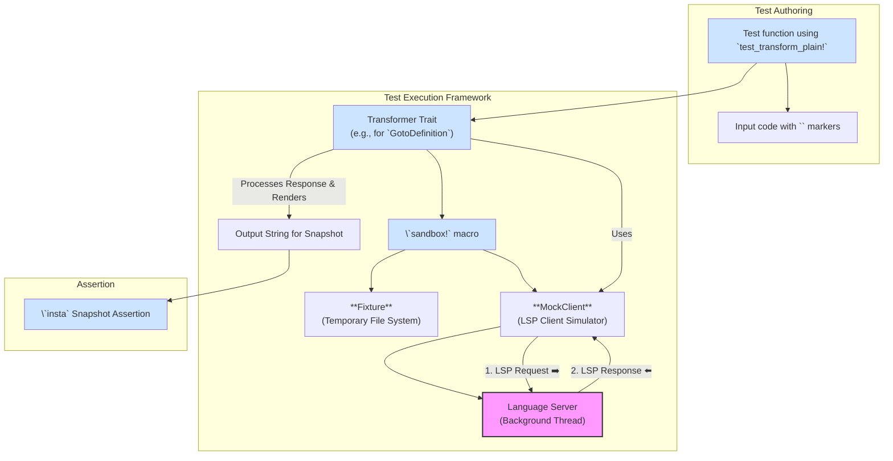

# TEST_DESIGN.md: A Guide to Architecting an e2e Language Server Test Suite for Cairo-M

## 1. Introduction & Philosophy

This document provides a comprehensive guide for designing and implementing a
robust end-to-end (e2e) test suite for the Cairo-M Language Server (cairo-m-ls).
The architecture is adapted from proven patterns in similar LS implementations
(e.g., cairols), tailored to our specific codebase. It emphasizes realistic
testing of our core components: project discovery via `ProjectController`,
diagnostic computation in `DiagnosticsController`, semantic analysis through
Salsa queries in `AnalysisDatabase`, and LSP features handled in `Backend`
(e.g., hover, goto_definition, completion).

Our testing philosophy is guided by these core principles:

- **High-Fidelity e2e Testing**: Test the entire LS as a black box, simulating
  real client-server interactions. This validates the full pipeline, from
  project loading in `ProjectModel` to semantic resolution via `ProjectCrate`
  and Salsa, catching integration bugs that unit tests miss (e.g., stale Salsa
  IDs after database swaps).
- **Minimal Mocking**: Do not mock the compiler phases (parser, semantic) or the
  LS itself. Only mock the LSP client (`MockClient`) to provide a synchronous
  API over the asynchronous protocol.
- **Snapshot-Driven Assertions**: Use [insta](https://insta.rs/) for snapshot
  testing. Tests provide input code; expected outputs (e.g., diagnostics, hover
  content) are auto-generated for review, making maintenance efficient.
- **Ergonomic Test Authoring**: Embed a simple DSL (`<caret>`, `<sel>`) in test
  strings for cursor positions and selections, mirroring editor interactions.
  For diagnostics, use markers like `<diag>` for expected error locations.
- **Extensible Test Harness**: Build around a generic `Transformer` trait for
  LSP features. Easily add tests for new capabilities (e.g., future rename or
  references) without boilerplate.

## 2. Architecture of the Test Harness

The harness layers abstract setup, execution, and assertion, focusing tests on
Cairo-M specifics like multi-file projects with `cairom.toml` manifests and
incremental Salsa analysis.

### 2.1 Overall Architecture



### 2.2 Recommended File Structure

Organize e2e tests by LSP feature, aligning with our `Backend` implementations.

```text
tests/e2e/
├── support/                # Core harness: MockClient, Fixture, etc.
│   ├── mod.rs
│   ├── fixture.rs
│   ├── mock_client.rs
│   ├── cursor.rs
│   ├── transform.rs
│   └── insta.rs
├── diagnostics/
│   ├── mod.rs              # Transformer for `publishDiagnostics`
│   └── basic_diagnostics.rs
├── goto_definition/
│   ├── mod.rs              # Transformer for `textDocument/definition`
│   └── cross_file_def.rs
├── hover/
│   ├── mod.rs              # Transformer for `textDocument/hover`
│   └── type_hover.rs
├── completion/
│   ├── mod.rs              # Transformer for `textDocument/completion`
│   └── keyword_completion.rs
└── main.rs                 # Entry: `mod support; mod diagnostics; ...`
```

## 3. The Test Harness: A Deep Dive

Components live in `tests/e2e/support/`. Adapt to our async architecture (tokio
channels, controllers) and Salsa-based analysis.

### 3.1. The Sandbox Environment (`sandbox!` macro)

`sandbox!` sets up an isolated test environment, handling our project manifests
and waiting for background processes like `ProjectController` updates.

**Responsibilities:**

1.  **Fixture Creation**: Manages a temp directory for files.
2.  **File System Population**: Declarative `files` block for `.cm` sources and
    `cairom.toml`.
3.  **Client Capabilities Configuration**: Specify LSP features (e.g., hover
    markdown support).
4.  **Workspace Configuration**: Set JSON for `workspace/configuration` (e.g.,
    debounce delay).
5.  **MockClient Instantiation**: Spawns LS, initializes, and waits for
    readiness (e.g., DB swapper init).

**Example (`tests/e2e/support/mod.rs`):**

```rust
macro_rules! sandbox {
    (
        $(files { $($file:expr => $content:expr),* $(,)? })?
        $(client_capabilities = $client_capabilities:expr;)?
        $(workspace_configuration = $overriding_workspace_configuration:expr;)?
    ) => {{
        let mut fixture = $crate::e2e::support::fixture::Fixture::new();
        $($(fixture.add_file($file, $content);)*)?

        let mut caps = $crate::e2e::support::client_capabilities::base();
        $(caps = $client_capabilities(caps);)?

        let mut config = serde_json::json!({
            "cairo_m": { "debounce_ms": 300 } // Default
        });
        $(
            $crate::e2e::support::merge_json(&mut config, &$overriding_workspace_configuration);
        )?

        $crate::e2e::support::MockClient::start(fixture, caps, config, /* cwd */ None)
    }};
}
pub(crate) use sandbox;
```

**Usage Example (Single-File Setup in `hover/type_hover.rs`):**

```rust
#[tokio::test]
async fn test_variable_type_hover() {
    test_transform!(
        HoverTransformer,
        r#"
fn main() {
    let x: felt = 42;
    let y = x<caret>;
    return y;
}
"#
    );
}
```

**Usage Example (Multi-File Setup in
`goto_definition/cross_file_definitions.rs`):**

```rust
#[tokio::test]
async fn goto_imported_function_definition() {
    let mut ls = sandbox! {
        files {
            "cairom.toml" => r#"
[project]
name = "test_project"
"#,
            "main.cm" => r#"
use math::add;

fn main() {
    let result = <caret>add(3, 4);
    return result;
}
"#,
            "math.cm" => r#"
fn add(a: felt, b: felt) -> felt {
    return a + b;
}
"#
        }
    };

    ls.open_and_wait_for_analysis("main.cm").await.unwrap();
    let (_code, cursors) = extract_cursors(/* code with <caret> */);

    let result = GotoDefinition::transform(&mut ls, cursors, None).await.unwrap();
    ::insta::assert_snapshot!(result);
}
```

### 3.2. The Mock Language Client (`MockClient`)

Synchronous wrapper for LSP interactions, adapted for our tokio-based channels
and controllers.

**Key Methods (`tests/e2e/support/mock_client.rs`):**

- `MockClient::start()`: Spawns LS thread, initializes (e.g., sets debounce via
  params).
- `send_request<R>()`: Sends typed request, blocks for response.
- `send_notification<N>()`: Sends notifications (e.g., `didOpen`).
- `wait_for_project_update()`: Waits for `ProjectController` to load (via traced
  messages or timeouts).
- `wait_for_diagnostics()`: Waits for `publishDiagnostics` from
  `DiagnosticsController`.

**Example Usage:**

```rust
let mut ls = sandbox! { /* ... */ };
ls.open_and_wait_for_project_update("main.cm");
let response = ls.send_request::<lsp_types::request::HoverRequest>(params);
```

**Full Example (from `diagnostics_test.rs`):**

```rust
#[tokio::test]
async fn test_basic_diagnostics() {
    test_transform!(
        DiagnosticsTransformer,
        r#"
fn main() {
    let _x = undefined_var; // This should produce an error
}
"#
    );
}
```

### 3.3. Project Fixtures and Multi-File Projects

`Fixture` handles our `cairom.toml`-based projects.

**Key Methods (`tests/e2e/support/fixture.rs`):**

- `Fixture::new()`: Temp dir.
- `add_file()`: Writes content.
- `root_path()` & `root_url()`: Root path/URL.
- `file_url()`: File-specific URL.

**Example Multi-File Setup:**

```rust
let mut ls = sandbox! {
    files {
        "cairom.toml" => r#"[project]\nname = "test""#,
        "main.cm" => "use lib::fn;",
        "lib.cm" => "fn fn() {}"
    }
};
```

**Manual Fixture Usage (for Complex Setups in `hover/cross_file_hover.rs`):**

```rust
let fixture = Fixture::new();
fixture.add_cairom_toml("test_project");
fixture.add_file(
    "main.cm",
    r#"
use utils::helper_foo;

fn main() {
    let result = helper_foo(42);
}
"#,
);
fixture.add_file(
    "utils.cm",
    r#"
fn helper_foo(x: felt) -> felt {
    return x * 2;
}
"#,
);

let (_, cursors) = extract_cursors(/* code with <caret> */);

test_transform!(HoverTransformer, fixture, cursors, |result: &str| {
    assert!(result.contains("function"), "{}", result);
});
```

### 3.4. The `Transformer` Pattern

Generic for our features; e.g., wait for diagnostics delta computation.

**Trait (`tests/e2e/support/transform.rs`):**

```rust
pub trait Transformer {
    fn capabilities(base: ClientCapabilities) -> ClientCapabilities;
    fn transform(ls: MockClient, cursors: Cursors, config: Option<serde_json::Value>) -> String;
    fn main_file() -> &'static str { "main.cm" }
}
```

**Test Macro (`tests/e2e/support/insta/mod.rs`):**

```rust
macro_rules! test_transform_plain {
    ($transform_type:ty, $code:literal, @$snapshot:literal) => {
        let (code, cursors) = crate::e2e::support::cursors($code);
        let mut ls = sandbox! { files { "main.cm" => code } /* ... */ };
        ls.open_and_wait_for_analysis("main.cm");
        let result = <$transform_type as Transformer>::transform(ls, cursors, None);
        ::insta::assert_snapshot!(result, @$snapshot);
    };
}
```

**Example Implementation for Goto Definition (`goto_definition/mod.rs`):**

```rust
impl Transformer for GotoDefinition {
    fn capabilities(base: ClientCapabilities) -> ClientCapabilities { /* ... */ }
    fn transform(
        client: &mut MockClient,
        cursors: Cursors,
        _config: Option<Value>,
    ) -> Result<String> {
        let position = cursors.assert_single_caret();
        // ... (params setup, send_request, response formatting with sanitize_path for snapshots)
    }
}
```

## 4. Step-by-Step Guide: Writing Tests

### 4.1 Writing a `textDocument/hover` Test

**Structure:** `tests/e2e/mod.rs` and `basic_hover.rs`.

#### Step 1: Transformer

```rust
impl Transformer for HoverTransformer {
    fn capabilities(base: ClientCapabilities) -> ClientCapabilities { /* ... */ }
    fn transform(mut ls: MockClient, cursors: Cursors, _config: Option<Value>) -> String {
        let position = cursors.assert_single_caret();
        let params = HoverParams { /* ... */ };
        let response: Option<Hover> = ls.send_request::<HoverRequest>(params);
        /* Render to string for snapshot */
    }
}
```

#### Step 2: Test

```rust
#[test]
fn hover_on_var() {
    test_transform_plain!(HoverRequest, r#"let x_<caret>: felt = 1;"#, @r#"/* snapshot */"#);
}
```

#### Step 3: Run/Review

Use `cargo test` and `cargo insta review`.

### 4.2 Writing a `textDocument/definition` Test

**Structure:** `tests/e2e/goto_definition/mod.rs` and `local_definitions.rs`.

#### Step 1: Transformer

```rust
struct GotoDefinition;

impl Transformer for GotoDefinition {
    fn capabilities(mut base: ClientCapabilities) -> ClientCapabilities {
        // Enable goto definition capability
        if let Some(ref mut text_document) = base.text_document {
            text_document.definition = Some(Default::default());
        }
        base
    }

    async fn transform(
        client: &mut MockClient,
        cursors: Cursors,
        _config: Option<Value>,
    -> Result<String> {
        let position = cursors.assert_single_caret();

        let params = GotoDefinitionParams {
            text_document_position_params: TextDocumentPositionParams {
                text_document: TextDocumentIdentifier {
                    uri: client.file_url(Self::main_file()),
                },
                position,
            },
            // ... (work params)
        };

        client.open_and_wait_for_analysis(Self::main_file()).await?;

        let response: Option<GotoDefinitionResponse> = client
            .send_request::<lsp_types::request::GotoDefinition>(params)
            .await?;

        // Format response for snapshot (e.g., "Definition at <TEMP_DIR>/math.cm:1:1")
        Ok(match response {
            ... (handle Scalar, Array, Link; sanitize paths for stable snapshots)
        })
}
}
```

#### Step 2: Test

```rust
#[tokio::test]
async fn goto_variable_definition() {
    test_transform!(
        GotoDefinition,
        r#"
fn main() {
    let x = 42;
    let y = <caret>x + 1;
    return y;
}
"#
    );
}
```

For multi-file, use `sandbox!` with `files { ... }`.

### 4.3 Writing a Diagnostics Test

**Structure:** `tests/e2e/diagnostics/mod.rs` and `basic_diagnostics.rs`.

#### Step 1: Transformer

```rust
pub struct DiagnosticsTransformer;

#[async_trait::async_trait]
impl Transformer for DiagnosticsTransformer {
    async fn transform(
        client: &mut MockClient,
        _cursors: Cursors,
        _config: Option<Value>,
    ) -> Result<String> {
        client.open_and_wait_for_analysis(Self::main_file()).await?;

        let main_uri = client.file_url(Self::main_file()).to_string();
        let diagnostics = client
            .wait_for_diagnostics(&main_uri, std::time::Duration::from_secs(5))
            .await?;

        Ok(format_diagnostics(&diagnostics))  // e.g., "1:9-9: Error: Undeclared identifier"
    }
}
```

(Note: Extend with `<diag>` markers for position assertions in future.)

#### Step 2: Test

```rust
#[tokio::test]
async fn test_basic_diagnostics() {
    test_transform!(
        DiagnosticsTransformer,
        r#"
fn main() {
    let _x = undefined_var; // This should produce an error
}
"#
    );
}
```

## 5. Advanced Topics

### Multi-File Diagnostics

Wait for `DiagnosticsController` via `wait_for_diagnostics()`.

### Salsa Incremental recompilation

Test changes: Send `didChange`, wait for delta updates.

### Debugging

Trace LSP messages; log Salsa queries.

Adapt for our async/Salsa setup for efficient, realistic testing.
