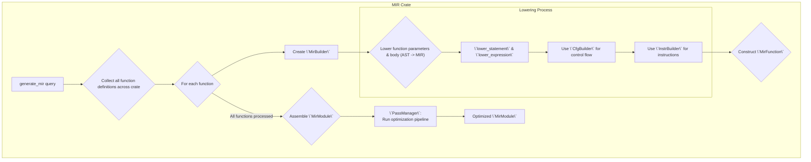

# Cairo-M Compiler: Mid-level Intermediate Representation (MIR)

This crate defines the Mid-level Intermediate Representation (MIR) for the
Cairo-M compiler. It provides an, SSA-based representation of the program
structured as a Control Flow Graph (CFG). This MIR is the foundation for
high-level optimizations before code generation and lowering to Cairo-M-Assmebly
(CASM).

## Overview

The MIR crate is a crucial phase in the Cairo-M compilation pipeline, sitting
between semantic analysis and code generation. It transforms the semantic
Abstract Syntax Tree (AST) into a lower-level, explicit representation that is
easier to analyze and optimize. The design is heavily inspired by LLVM IR,
featuring a Control Flow Graph (CFG) of basic blocks, instructions in
three-address code (TAC) format, and Static Single Assignment (SSA) form for
values. This structure facilitates a suite of optimization passes, such as
constant folding, copy propagation, and dead code elimination, to improve the
efficiency of the final generated code.

## Architecture

The core of the MIR is a hierarchy of data structures:

- **`MirModule`**: The top-level container, representing an entire compilation
  unit (crate). It holds all functions and global information.
- **`MirFunction`**: Represents a single function as a Control Flow Graph (CFG).
  It contains all basic blocks, value types, and SSA-related state.
- **`BasicBlock`**: A sequence of straight-line code ending in a single
  terminator instruction. Basic blocks are the nodes in the CFG.
- **`Instruction`**: A single, non-control-flow operation (e.g., arithmetic,
  memory access, function calls). Instructions operate on `Value`s.
- **`Terminator`**: An instruction that ends a `BasicBlock` and dictates control
  flow (e.g., `Jump`, `If`, `Return`).
- **`Value`**: Represents data, which can be a literal constant or an `Operand`
  (a virtual register, identified by a `ValueId`).

The entry point to this crate is the Salsa-tracked query `generate_mir`. The
process of generating MIR from the semantic model can be visualized as follows:



## Organization and Development Guidelines

The `cairo-m-compiler-mir` crate is structured to separate concerns, making it
modular and easier to maintain.

- **Project Layout**:
  - `src/`: Contains the core data structures (`module.rs`, `function.rs`,
    `basic_block.rs`, `instruction.rs`, `terminator.rs`, `value.rs`,
    `mir_types.rs`).
  - `src/db.rs`: Defines the `MirDb` trait for Salsa integration, connecting MIR
    generation to the rest of the compiler's incremental framework.
  - `src/lowering/`: Houses the logic for translating the semantic AST into MIR.
    The main entry point is `function.rs`, with helpers for expressions
    (`expr.rs`), statements (`stmt.rs`), and control flow (`control_flow.rs`).
  - `src/builder/`: Provides fluent builder APIs (`CfgBuilder`, `InstrBuilder`)
    for programmatically constructing MIR, simplifying the lowering process.
  - `src/passes/`: Implements various optimization passes like
    `ConstantFolding`, `CopyPropagation`, `DeadCodeElimination`, and `SROA`. The
    `PassManager` orchestrates the optimization pipeline.
  - `tests/`: Contains integration and snapshot tests that verify the
    correctness of the entire MIR generation and optimization pipeline.

- **Development & Testing Dependencies**:
  - **`salsa`**: The core dependency for incremental compilation. All MIR
    generation is managed through Salsa queries.
  - **`index_vec`**: Used for efficient and type-safe identifiers (`FunctionId`,
    `BasicBlockId`, `ValueId`).
  - **`insta`**: A critical tool for snapshot testing. Most tests in this crate,
    especially in `mdtest_snapshots.rs`, rely on `insta` to verify the
    pretty-printed MIR output against approved snapshots. When making changes,
    developers should run `cargo insta review` to approve any legitimate changes
    to the MIR output.

- **Testing Strategy**:
  - **Unit Tests**: Co-located within the source files (e.g., `cfg.rs`,
    `passes/*.rs`) to test specific functionalities in isolation.
  - **Integration Tests**: Located in the `tests/` directory. These tests cover
    multi-file projects (`multi_file_integration.rs`) and complex language
    features (`aggregate_patterns.rs`).
  - **Snapshot Tests**: The `mdtest_snapshots.rs` test automatically runs the
    MIR generation pipeline on all Cairo-M code snippets found in the `mdtest`
    directory, providing broad coverage and ensuring that changes don't
    unexpectedly alter the generated IR.

## Usage Example

The primary way to use this crate is via the `generate_mir` Salsa query. This is
typically invoked by the next stage in the compiler (e.g., code generation). For
testing or standalone use, you can set up a test database and call the query
directly.

```rust
use cairo_m_compiler_mir::{generate_mir, MirDb, PrettyPrint};
use cairo_m_compiler_parser::Upcast;
use cairo_m_compiler_semantic::{db::Crate, File, SemanticDb};
use std::collections::HashMap;
use std::path::PathBuf;

// 1. Set up a test database that implements all necessary DB traits.
#[salsa::db]
#[derive(Default)]
struct TestDatabase {
    storage: salsa::Storage<Self>,
}

#[salsa::db]
impl salsa::Database for TestDatabase {}

#[salsa::db]
impl cairo_m_compiler_parser::Db for TestDatabase {}

#[salsa::db]
impl SemanticDb for TestDatabase {}

#[salsa::db]
impl MirDb for TestDatabase {}

// Implement Upcast traits for the database...
// (see tests/common/mod.rs for a full example)
impl Upcast<dyn cairo_m_compiler_parser::Db> for TestDatabase {
    fn upcast(&self) -> &(dyn cairo_m_compiler_parser::Db + 'static) { self }
    fn upcast_mut(&mut self) -> &mut (dyn cairo_m_compiler_parser::Db + 'static) { self }
}
impl Upcast<dyn SemanticDb> for TestDatabase {
    fn upcast(&self) -> &(dyn SemanticDb + 'static) { self }
    fn upcast_mut(&mut self) -> &mut (dyn SemanticDb + 'static) { self }
}

// 2. Define source code and create a Crate.
let db = TestDatabase::default();
let source_code = "fn main() -> felt { return 42; }";
let file = File::new(&db, source_code.to_string(), "main.cm".to_string());

let mut modules = HashMap::new();
modules.insert("main".to_string(), file);
let crate_id = Crate::new(
    &db,
    modules,
    "main".to_string(),
    PathBuf::from("."),
    "my_crate".to_string(),
);

// 3. Invoke the generate_mir query.
match generate_mir(&db, crate_id) {
    Ok(mir_module) => {
        // Successfully generated MIR
        println!("Generated MIR Module:\n{}", mir_module.pretty_print(0));
    }
    Err(diagnostics) => {
        // Handle compilation errors
        eprintln!("MIR generation failed with diagnostics: {:?}", diagnostics);
    }
}
```

## Debugging

When compiling a program, you can set the `DEBUG_MIR` environment variable to
`1` to print the MIR to the console.
